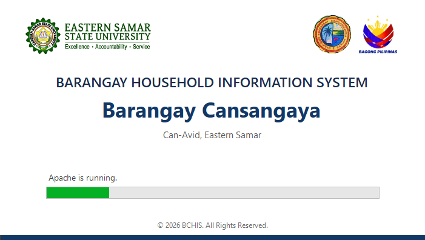
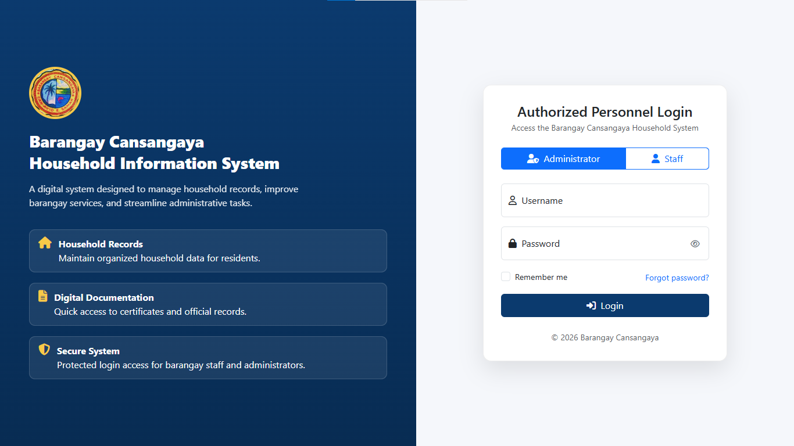
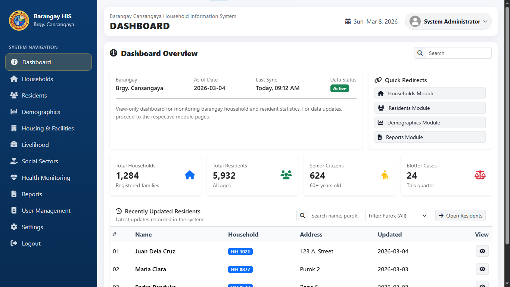

# Barangay Household Information System (BHIS)
### Barangay Cansangaya – Can-Avid, Eastern Samar

This guide explains how to install and start the **Barangay Household Information System (BHIS)**.

---

# Folder Structure

Your system package should look like this:

Barangay-Cansangaya-Household-Information-System
│
├─ app
├─ docs
│  ├─ startup.png
│  ├─ login.png
│  └─ dashboard.png
│
├─ logs
├─ public
├─ setup
│  └─ Setup.exe
│
└─ README.md

**Do not rename or move any of these folders.**

---

# System Requirements

Before installing, make sure your computer has:

- Windows 10 or Windows 11
- XAMPP installed in C:\xampp
- At least 4 GB RAM
- At least 2 GB free disk space

If XAMPP is not installed, please install it first.

---

# Installation Steps

## Step 1 — Open the System Folder

Open the folder:

Barangay-Cansangaya-Household-Information-System

---

## Step 2 — Run the Installer

Open the **setup** folder and double-click:

Setup.exe

Follow the installation instructions on the screen.

The installer will install the **BHIS Launcher** on your computer.

---

# Starting the System

After installation:

1. Go to your Desktop
2. Double-click the icon:

Barangay Household Information System

The launcher will automatically:

- Start Apache
- Start MySQL
- Open the system in your browser

---

# System Screenshots

## Startup Launcher

The launcher prepares the system and starts the required services.

---

## Login Screen

Enter your assigned username and password to log in.

---

## Dashboard

After logging in, the dashboard displays the main system functions and barangay data.

---

# Opening the System Manually (Optional)

If needed, you can open the system directly using your web browser.

http://localhost/Barangay-Cansangaya-Household-Information-System

---

# Important Notes

- Do not rename the system folder.
- Do not move the system folder after installation.
- XAMPP must remain installed in C:\xampp

Changing these may cause the system to stop working.

---

# Troubleshooting

If the system does not open:

1. Make sure XAMPP is installed in C:\xampp
2. Make sure Apache and MySQL can run
3. Restart the BHIS Launcher

---

# Technical Support

If you encounter problems, please contact the system developer or IT administrator.

---

© 2026 BCHIS — Barangay Cansangaya Household Information System
All Rights Reserved.
